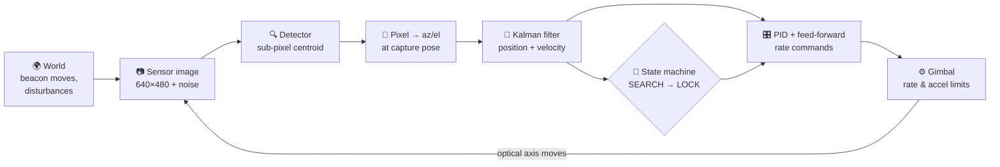

<div align="center">


# ASTRAQ
### Autonomous Spatial Tracking & Alignment for Optical Links

**Smart India Hackathon 2026 · Problem Statement SIH26169**
*Development of an AI-Based Virtual Camera Tracking System for Coarse Alignment of Mobile Free Space Optical Communication (FSOC) Terminals*

ISRO / Department of Space · Software · Smart Automation, Space Technology

<br/>


### 🔗 [**Open the live prototype**](https://YOUR-DEPLOYED-LINK.vercel.app) · no install, runs in your browser

<br/>


</div>

---

## 🛰️ The problem, in plain words

Imagine standing on the back of a moving truck, holding a pair of binoculars and trying to keep a tiny torch spot on a passing satellite perfectly centred, while the truck shakes, fog rolls in, and you have two seconds to find it in the first place.

That is what an optical (laser) communication terminal has to do. Laser links carry huge amounts of data securely, but the beam is so narrow that both ends must point at each other almost perfectly. Before any fine laser alignment can begin, a camera on a motorised pan/tilt mount must **find** the partner's beacon light and **centre** it. This step is called **coarse alignment**.

Testing this on real hardware is expensive, slow and impossible to repeat exactly. ISRO asked for a **virtual testbed**: software that simulates the camera, the moving beacon and every real-world disturbance, and a tracking system that locks on by itself and holds the lock under strict performance numbers.

## 💡 Our solution

**ASTRAQ** is a 3D mission simulator with a tracking engine you can watch.

A mobile FSOC truck at Bengaluru points a telescope on a pan/tilt gimbal at a LEO satellite 550 km up. The simulation renders the camera's **actual 640×480 image**, with noise, stars, fog and rain. A computer-vision detector finds the beacon, a Kalman filter predicts where it is heading, a PID controller drives the gimbal, and an explainable state machine takes it from **SEARCHING → DETECTED → ACQUIRING → TRACKING → LOCKED**, logging the reason for every decision.

Everything is scored live against ground truth on a **PS169 acceptance card**.

<table>
<tr>
<td width="33%"><br/><sub><b>Mobile terminal</b>: truck, mast, pan/tilt gimbal, telescope</sub></td>
<td width="33%"><br/><sub><b>Live sensor image</b>: detection, centroid, Kalman prediction</sub></td>
<td width="33%"><br/><sub><b>Orbit view</b>: real coastlines, true geometry</sub></td>
</tr>
</table>

### ✨ What makes it different

| | |
|---|---|
| 🔭 **Wide-field acquisition** | Scans at 12°, detects, then zooms to the 4° tracking view, like NASA's OPALS terminal. It locks from a random start in **1.1 s on average**; the 4°-only optics need up to 12.7 s. |
| 🧠 **Kalman on azimuth/elevation** | The filter tracks the target's *real* motion rather than pixel motion, and feeds its velocity forward to the gimbal. That gives **4× lower error** (3.7 px vs 14.9 px, measured). |
| 🎥 **Real image in the loop** | The camera panel *is* the image the detector processes. It is not a drawing of where the target should be. |
| 🗣️ **Explainable decisions** | Every state change says why, for example *"6 consecutive misses (coast limit 5)"*. |
| 🌍 **Physically true 3D** | Real Natural Earth coastlines, a real orbit, and true directions and ranges. Anything exaggerated for visibility is labelled. |
| ⚡ **Zero setup** | The full simulation runs in a browser Web Worker. An optional Python server runs the same engine. |
| 🎞️ **Benchmark-2 ready** | Upload an MP4 and the camera is bypassed. The same detector produces a per-frame centroid log and an RMSE. |

## 📊 Results (measured, not claimed)

| PS169 requirement | Target | ASTRAQ | |
|---|---|---|---|
| Acquisition time | ≤ 2 s | **1.13 s** mean · 1.50 s max (20 random starts) | ✅ |
| Tracking error | ≤ 10 px | **2.97 px** RMS | ✅ |
| Target loss | < 5 % | **0 %** after lock, in all 8 scenarios | ✅ |
| Processing speed | ≥ 20 FPS | 30 Hz loop · detector ≈ 1.5 ms/frame | ✅ |
| Video centroid accuracy | as low as possible | **0.045 px** RMSE at 58–88 fps | ✅ |
| Automated tests | | **51 (TypeScript) + 30 (Python)**, all passing | ✅ |

<details>
<summary><b>All 8 scenarios</b> (20 seeds × 15 s each)</summary>

| Scenario | Locked | Acquisition mean / max | RMS error |
|---|---|---|---|
| Open Sky | 20/20 | 1.13 s / 1.50 s | 2.97 px |
| PS169 Baseline (4° only) | 20/20 | 6.66 s / 12.70 s | 2.78 px |
| Moving Platform | 20/20 | 1.20 s / 1.50 s | 7.02 px |
| High Jitter (±20 px/frame) | 20/20 | 1.13 s / 1.47 s | 17.44 px ¹ |
| Weak Beacon | 20/20 | 4.03 s / 9.30 s | 5.14 px |
| Fast Target | 20/20 | 1.03 s / 2.33 s | 9.79 px |
| Acquisition Challenge | 20/20 | 3.88 s / 4.07 s | 3.08 px |
| LEO Pass | 20/20 | 0.99 s / 1.00 s | 2.86 px |

¹ Random ±20 px shake alone is ≈ 16 px RMS. No coarse gimbal can cancel shake it sees a frame late, so this is a physical floor, and we report it honestly. Full details are in [TEST_REPORT.md](TEST_REPORT.md).
</details>

## ⚙️ How it works



Every 1/30 s:
1. **Capture.** Render the frame the camera *actually* sees, including platform shake that the encoders can't measure.
2. **Detect.** Clean salt & pepper noise, estimate the background robustly (median/MAD), find blobs, score them by size and SNR, reject anything far from the prediction, and compute an intensity-weighted **sub-pixel centroid**.
3. **Estimate.** Convert the pixel to an absolute direction and update a constant-velocity **Kalman filter** with a χ² outlier gate and adaptive noise.
4. **Control.** Run the **PID** with three anti-windup guards plus Kalman velocity feed-forward, driving a gimbal limited to 5 °/s and 30 °/s² with a realistic motor lag.
5. **Decide.** The supervisor confirms detections (2 of 3, spatially consistent), locks after 6 frames under 10 px, coasts through misses, and searches locally if the beacon is lost.
6. **Score.** Compare against ground truth. Only the metrics module ever sees the truth.

## 🧰 Tech stack

| Layer | Technology |
|---|---|
| **Frontend** | React 19 · TypeScript 5.9 (strict) · Vite 8 |
| **3D graphics** | three.js · React Three Fiber · drei · postprocessing (bloom) |
| **State & threading** | zustand · Web Workers (simulation and batch run off the UI thread) |
| **Map data** | Natural Earth coastlines (world-atlas + topojson-client) |
| **Backend (optional)** | Python 3.11 · FastAPI · uvicorn · WebSocket |
| **Numerics & vision** | numpy · pydantic · OpenCV (MP4 benchmark) |
| **Testing & quality** | vitest · pytest · httpx · ESLint 9 · tsc strict |
| **Deployment** | Vercel / Netlify (static frontend) · Render (API) |

## 🎮 Try it in 30 seconds

Open the **[live prototype](https://YOUR-DEPLOYED-LINK.vercel.app)**, then:

| Press | To |
|---|---|
| **D** | Run the 90-second guided demo (motion types, fog, loss and reacquisition) |
| **R** | Reset with a new random start and watch it lock |
| **1 – 5** | Switch views: Overview · Terminal · Spacecraft · Sensor POV · Orbit |
| **A** | Open live graphs and the PS169 acceptance card |
| **S** | Enlarge the camera image |
| **M** | Take manual control of the gimbal (arrow keys) |
| **?** | Show all shortcuts |

## 🚀 Run locally

```bash
# Frontend + built-in engine (all you need)
cd web
npm install
npm run dev            # → http://localhost:5173
```

```bash
# Optional: Python engine, REST/WebSocket API and MP4 benchmark
cd server
python -m venv .venv && source .venv/bin/activate   # Windows: .venv\Scripts\activate
pip install -r requirements.txt
python -m uvicorn app.main:app --port 8000          # API docs → http://localhost:8000/docs
```
Then in the app, open **Experiment ▸ Engine ▸ FastAPI server ▸ Connect**.

Requirements: Node.js 20+ and a WebGL 2 browser; Python 3.11+ only for the optional server. To host it online, see **[DEPLOYMENT.md](DEPLOYMENT.md)**.

## 🧪 Features at a glance

- **9 target motions:** stationary, linear, circular, sinusoidal, figure-8, spiral, random, custom click-drawn waypoints, and a real LEO pass with ephemeris error
- **Every PS disturbance:** Gaussian, Poisson and salt & pepper noise · jitter · vibration · platform motion · wind · clear/haze/fog/rain/low-light · turbulence · beacon dropouts · decoy glint
- **8 scenario presets** and a **90 s scripted demo**
- **Live analysis:** 6 graphs, the PS169 acceptance card, mission timeline, Alignment Quality Score, and a link-budget preview
- **Experiments:** record → CSV/JSON export → replay → Monte-Carlo batch over many seeds
- **3D measurement tool:** click the truck, satellite, Moon or Earth to get range, azimuth/elevation and angle off the optical axis
- **Camera calibration view,** a sensor POV through the telescope, and Low/Medium/High quality levels
- **Full REST + WebSocket API** with an MP4 video benchmark endpoint

## 📁 Project structure

```
ASTRAQ/
├── web/                 React + TypeScript app (includes the default engine)
│   └── src/
│       ├── core/        simulation core, pure TS: optics, detection, Kalman, PID, state machine, metrics
│       ├── engine/      Web Worker hosts + message protocol
│       ├── services/    TelemetryProvider: Local · Remote (WebSocket) · Replay
│       ├── scene/       3D scene: Earth, sky, truck, satellite, optics overlays
│       └── hud/         top bar, sensor view, dock, drawers, analysis
├── server/              optional FastAPI engine (numpy port + MP4 benchmark + tests)
└── docs/                detailed guide, competitor analysis, screenshots, test results
```

## 📚 Documentation

| Document | What's inside |
|---|---|
| [docs/ASTRAQ_User_Manual.pdf](docs/ASTRAQ_User_Manual.pdf) | Plain-language user manual with annotated screenshots |
| [docs/DETAILED_GUIDE.md](docs/DETAILED_GUIDE.md) | Every control, parameter, algorithm, API endpoint and troubleshooting tip |
| [ARCHITECTURE.md](ARCHITECTURE.md) | Design principles, data flow, message protocol |
| [FEATURES.md](FEATURES.md) | Requirement-by-requirement coverage |
| [TEST_REPORT.md](TEST_REPORT.md) | Every test and benchmark with numbers |
| [RUN_GUIDE.md](RUN_GUIDE.md) | Quick start and a 3-minute judge demo script |
| [DEPLOYMENT.md](DEPLOYMENT.md) | Put it online in 10 minutes |

## 🧭 Honest scope

ASTRAQ is a **simulation**. It covers the full coarse-alignment loop. These are **not** implemented:
- a learned detector (YOLO is an interface stub, clearly marked *planned*);
- real camera or gimbal hardware;
- the fine-pointing stage (a hand-over check only);
- a standalone .exe.

The link budget and acquisition-probability panels are simplified models and are labelled as such.

**Next steps:**
- an SNR-gated learned detector benchmarked against the classical one;
- an IMM motion filter;
- a fine-steering-mirror stage;
- hardware in the loop through the two existing seams (frame source and rate command).

## 👥 Team

| Name | Role |
|---|---|
| *Your name* | *Role* |
| *Teammate* | *Role* |

<div align="center">
<sub>Built for Smart India Hackathon 2026 · SIH26169 · Coastline data © Natural Earth (public domain)</sub>
</div>
