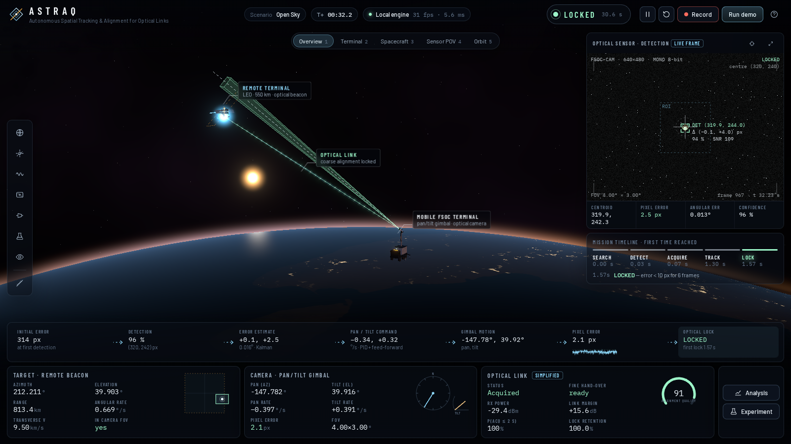
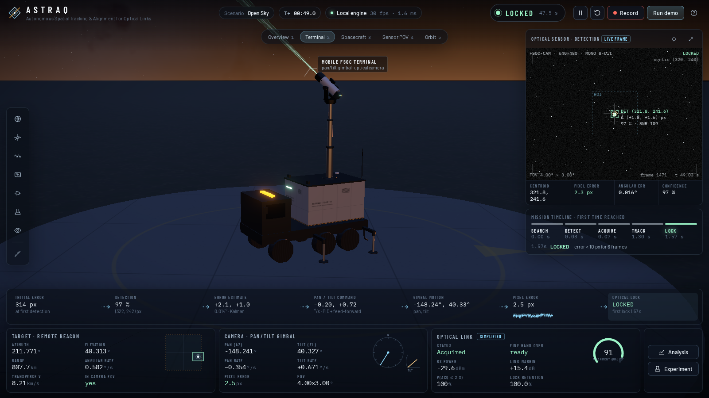
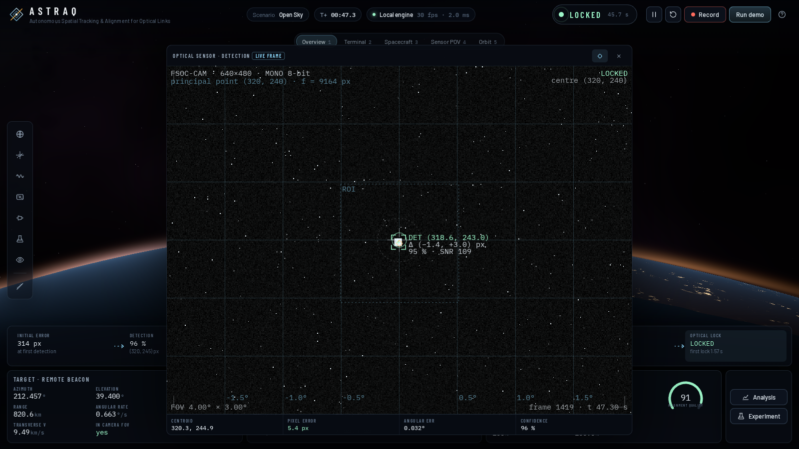
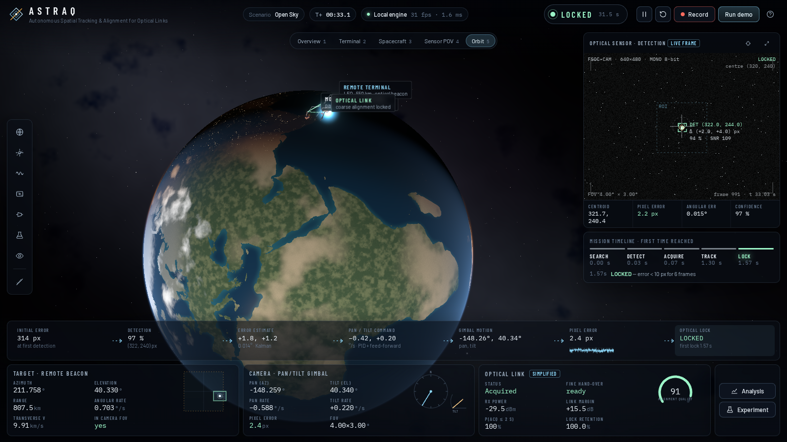

# ASTRAQ
**Autonomous Spatial Tracking & Alignment for Optical Links**

ASTRAQ is a 3D simulation of AI-assisted **coarse alignment and tracking for mobile free-space optical communication (FSOC) terminals**. A mobile ground terminal has an optical camera on a pan/tilt gimbal. The camera finds the optical beacon of a remote terminal (a LEO spacecraft by default), estimates where the beacon is going, and steers the gimbal until the beacon stays within 10 pixels of the image centre. At that point the link is *coarse-locked* and a fine-pointing stage could take over.

```
MOBILE FSOC TERMINAL → OPTICAL CAMERA → TARGET DETECTION → COARSE ALIGNMENT → OPTICAL BEACON → SATELLITE / REMOTE TERMINAL → OPTICAL LINK
```

It was built for the SIH26169 / PS169 problem statement ("AI-based virtual camera tracking system for coarse alignment of mobile FSOC terminals").



| Terminal & gimbal | Sensor feed (calibration grid) | Orbit view |
|---|---|---|
|  |  |  |

---

## Contents
1. [What ASTRAQ is](#1-what-astraq-is)
2. [Project architecture](#2-project-architecture)
3. [Requirements](#3-requirements)
4. [Installation](#4-installation)
5. [Running the project](#5-running-the-project)
6. [Starting the frontend](#6-starting-the-frontend)
7. [Starting the backend](#7-starting-the-backend-optional)
8. [Demo mode](#8-demo-mode)
9. [Controls](#9-controls)
10. [Simulation parameters](#10-simulation-parameters)
11. [Tracking pipeline](#11-tracking-pipeline)
12. [Camera model](#12-camera-model)
13. [Detection model](#13-detection-model)
14. [Kalman filter](#14-kalman-filter)
15. [PID controller](#15-pid-controller)
16. [Experiment recording](#16-experiment-recording)
17. [CSV export](#17-csv-export)
18. [Troubleshooting](#18-troubleshooting)
19. [Building for production](#19-building-for-production)
20. [Future AI integration](#20-future-ai-integration)

Other documents: [RUN_GUIDE.md](RUN_GUIDE.md) (quick start + judge demo script) · [ARCHITECTURE.md](ARCHITECTURE.md) · [FEATURES.md](FEATURES.md) · [TEST_REPORT.md](TEST_REPORT.md) · [docs/COMPETITOR_ANALYSIS.md](docs/COMPETITOR_ANALYSIS.md)

---

## 1. What ASTRAQ is

| You see | What it is |
|---|---|
| Full-screen 3D view | Earth with real coastlines, a twilight atmosphere and stars. A **mobile ground terminal** (truck, telescopic mast, pan/tilt gimbal, telescope) stands on it, and a **LEO spacecraft** carries the optical beacon. The camera's field-of-view frustum, the optical axis, the search field and scan path, the beacon trajectory and the optical link are drawn in the scene. |
| Sensor panel (top right) | The **actual 640×480 image rendered by the simulation**: stars, beacon spot and noise. The detector processes exactly this image. The overlays show the centroid, the error vector, the Kalman prediction, the lock circle and the ROI. |
| Mission timeline | When SEARCH, DETECT, ACQUIRE, TRACK and LOCK were first reached, with the reason for the latest state change. |
| Alignment chain (bottom) | The coarse-alignment loop, left to right, with live values: initial error → detection → error estimate → pan/tilt command → gimbal motion → pixel error → optical lock. |
| Target · Camera · Link panels | The key readouts only. Every other parameter sits in drawers that open from the left tool rail. |

**Engines.** The same simulation core runs in three places and feeds the same UI:
* **Local engine.** A TypeScript engine in a browser Web Worker. This is the default and needs no backend.
* **FastAPI engine.** A Python port with REST and WebSocket telemetry, experiments, batch runs and an MP4 video benchmark.
* **Replay.** Plays back any recorded run.

**What is real vs simplified.** The camera projection, rendered image, image detector, Kalman filter, PID, gimbal dynamics, state machine, disturbances, metrics and recording are all real computations. The link budget, acquisition-probability estimate and atmosphere model are simplified, and each is labelled in the UI. The *synthetic* detector is a labelled statistical model. **YOLO detection and hardware cameras are planned and are not implemented.**

## 2. Project architecture

```
ASTRAQ/
├── web/                         React + TypeScript + Vite front end (and the default engine)
│   └── src/
│       ├── core/                simulation core — pure TS, no DOM/three.js (runs in worker, tests, mirrored in Python)
│       │   ├── config.ts        typed configuration + PS169 defaults
│       │   ├── geometry.ts      site ENU frame, az/el, gnomonic field coords, orbital pass
│       │   ├── target/          trajectories (stationary … custom, LEO pass)
│       │   ├── optics/          pinhole camera, sensor-frame renderer, star catalogue
│       │   ├── detection/       DetectionProvider interface, centroid (CV) + synthetic providers
│       │   ├── estimation/      Kalman filter (az/el, constant velocity, adaptive R)
│       │   ├── control/         PID, gimbal dynamics, search patterns
│       │   ├── tracking/        acquisition/tracking state machine
│       │   ├── disturbance/     vibration, jitter, platform motion, wind, atmosphere, turbulence
│       │   ├── analysis/        PS169 metrics, link budget, acquisition probability, quality score
│       │   ├── telemetry/       snapshot types, recorder (CSV/JSON)
│       │   ├── demo/            90 s scripted demonstration
│       │   └── engine.ts        the closed loop
│       ├── engine/              Web Worker hosts (live engine, batch runner) + message protocol
│       ├── services/            TelemetryProvider: Local / Remote (WebSocket) / Replay
│       ├── state/               zustand store + high-rate buffers
│       ├── scene/               React Three Fiber scene (Earth, sky, models, optics overlays, camera rig)
│       ├── hud/                 UI: top bar, sensor view, timeline, dock, drawers, analysis, help
│       └── app/                 application shell + keyboard shortcuts
├── server/                      Python FastAPI engine (optional)
│   ├── astraq_engine/           numpy port of the simulation core + video benchmark
│   ├── app/                     FastAPI app (REST + WebSocket) and simulation service
│   ├── scripts/                 run_batch.py, make_test_video.py
│   └── tests/                   pytest suite
├── docs/                        competitor analysis, screenshots
└── README · RUN_GUIDE · ARCHITECTURE · FEATURES · TEST_REPORT
```

Details, data flow and the message protocol are in [ARCHITECTURE.md](ARCHITECTURE.md).

## 3. Requirements

| Needed for | Software |
|---|---|
| The web app and demo (**required**) | **Node.js 20 or newer** (includes npm) and a desktop browser with WebGL 2 (Chrome, Edge, Firefox or Safari) |
| The Python engine (**optional**) | **Python 3.11 or newer** |
| MP4 video benchmark (optional) | `opencv-python-headless`, installed by `requirements.txt` |

A laptop with integrated graphics runs ASTRAQ at *Medium* quality. On slower machines, use View ▸ Render quality ▸ *Low*.

## 4. Installation

1. Install **Node.js 20+** from <https://nodejs.org> (LTS). To check, open a terminal and run `node -v`.
2. *(Optional, for the backend)* Install **Python 3.11+** from <https://python.org>. On Windows, tick **"Add python.exe to PATH"**. Check with `python --version`.
3. Extract **ASTRAQ.zip** somewhere, for example `C:\ASTRAQ` or `~/ASTRAQ`.
4. Open a terminal:
   * Windows: press Start, type **cmd** or **PowerShell**, and press Enter.
   * macOS: open **Terminal**.
   * Linux: open your terminal.
5. Install the web app dependencies. This is needed once and takes 1–2 minutes:

```bash
cd ASTRAQ/web
npm install
```

6. *(Optional)* Install the Python engine in a **second** terminal:

```bash
cd ASTRAQ/server
python -m venv .venv
```
Activate the virtual environment:
* Windows: `.venv\Scripts\activate`
* macOS / Linux: `source .venv/bin/activate`

Then install the packages:
```bash
pip install -r requirements.txt
```

## 5. Running the project

The minimum is **one terminal**:

```bash
cd ASTRAQ/web
npm run dev
```

Open **http://localhost:5173** in your browser. The simulation starts immediately. Within about 1.5 s the terminal acquires the beacon and the state badge turns **LOCKED**.

Shortcut scripts do the same thing: `start-web.bat` (Windows) or `./start-web.sh` (macOS/Linux) in the ASTRAQ folder.

## 6. Starting the frontend

**Terminal 1** (always):
```bash
cd ASTRAQ/web
npm run dev          # development server at http://localhost:5173
```
Stop it with **Ctrl + C**.

## 7. Starting the backend (optional)

The backend is needed only if you want the Python engine, REST/WebSocket access, server-side experiments or the MP4 video benchmark.

**Terminal 2:**
```bash
cd ASTRAQ/server
.venv\Scripts\activate            # Windows   (macOS/Linux: source .venv/bin/activate)
python -m uvicorn app.main:app --reload --port 8000
```

* API docs (interactive): **http://localhost:8000/docs**
* Health check: http://localhost:8000/api/health

**Connecting the UI to the backend:** open the **Experiment** drawer (flask icon on the left rail), go to **Engine**, choose **FastAPI server** and click **Connect**. The source chip in the top bar changes to *FastAPI engine*. If the server cannot be reached, ASTRAQ tells you and stays on the local engine.

Main endpoints:

| Method | Path | Purpose |
|---|---|---|
| GET | `/api/health`, `/api/status` | liveness, current state, metrics |
| POST | `/api/sim/start`, `/api/sim/stop`, `/api/sim/reset`, `/api/sim/demo?on=true` | control |
| POST | `/api/sim/step?frames=N` | advance synchronously (scripting) |
| POST | `/api/sim/command` | any UI command (same JSON as the WebSocket) |
| GET / PATCH / PUT | `/api/config` | read, patch or replace the configuration |
| GET / POST | `/api/presets`, `/api/presets/{id}` | scenario presets |
| GET | `/api/telemetry`, `/api/telemetry/history?seconds=10`, `/api/frame.pgm` | latest snapshot, series, sensor image |
| POST | `/api/experiments/start`, `/api/experiments/stop` | record the live run |
| GET | `/api/experiments`, `/api/experiments/{id}`, `/{id}/csv`, `/{id}/json` | list and export |
| POST | `/api/experiments/batch` | Monte-Carlo batch `{runs, durationS, preset}` |
| POST | `/api/video/analyze` | MP4 benchmark (multipart: `file`, optional `truth` CSV) |
| WS | `/ws/telemetry` | live snapshots (JSON) + sensor frames (binary) + commands |

## 8. Demo mode

Click **Run demo** (top right) or press **D**. This starts a 90-second scripted sequence. Only the scenario changes; the tracking you see is the real closed-loop response.

| Time | Phase |
|---|---|
| 0–10 s | Acquisition of a **stationary** beacon from a random start (wide-field scan, then zoom to 4°) |
| 10–25 s | **Linear** motion |
| 25–45 s | **Circular** motion |
| 45–60 s | **Sinusoidal** motion |
| 60–70 s | **Detection degradation**: fog, heavy noise, 60 % dropouts. The tracker goes LOST and reacquires |
| 70–90 s | **Recovery and reacquisition** on a figure-8 |

A caption at the top explains each phase. Use the view buttons (Overview, Terminal, Spacecraft, Sensor POV, Orbit) during the demo. The recommended judge script is in [RUN_GUIDE.md](RUN_GUIDE.md).

## 9. Controls

| Input | Action |
|---|---|
| **Mouse drag / wheel / right-drag** | orbit / zoom / pan the 3D view |
| **1 – 5** | views: Overview · Terminal · Spacecraft · Sensor POV · Orbit |
| **Space** | run / pause |
| **R** | reset (new random start) |
| **D** | demo on/off |
| **S** | expand the sensor view |
| **A** | analysis graphs |
| **M** | manual pan/tilt mode (then **← ↑ → ↓** jog 0.1°, Shift for 1°) |
| **?** | help overlay · **Esc** closes panels |
| Left tool rail | Scenario · Target · Disturbances · Tracking · Optics & link · Experiment · View · 3D measurement |

**3D measurement:** click the ruler icon, then click the terminal, the spacecraft, the Moon or any point on the Earth. ASTRAQ shows the true range, azimuth/elevation and angle from the optical axis. Clicking a second object gives the distance and angular separation between the two.

## 10. Simulation parameters

Every parameter can be changed live in the drawers. The defaults follow the PS169 table.

| Group | Parameters (default) |
|---|---|
| Camera | 640×480 mono, **HFOV 4°** (VFOV 3°), 30 Hz, pixel pitch 5 µm; wide-field acquisition 12° with zoom-in after detection |
| Target | trajectory (stationary, linear, circular, sinusoidal, figure-8, spiral, random, custom waypoints, LEO pass), speed, amplitude, period, direction, start (random / fixed), spot 10 px square/disk/Gaussian, intensity |
| Search field | ±6.25° around the predicted line of sight (2000 px × 0.00625 °/px) |
| Gimbal | max rate 5 °/s (PS 5–10), acceleration 30 °/s², tilt −5…88° |
| Disturbances | Gaussian σ (≤ 20 DN), salt & pepper (≤ 10 %), Poisson; jitter (≤ ±20 px/frame); vibration px/Hz; platform motion linear/circular/random; wind torque; target motion noise; atmosphere clear/haze/fog/rain/low-light + strength; turbulence; dropouts; decoy glint |
| Detection | provider, threshold k·σ, min confidence, association gate, latency frames |
| Kalman | on/off, process noise q, measurement noise r, innovation gate |
| PID | Kp 8, Ki 1, Kd 0.05, integral limit, integral zone, feed-forward, control rate 60 Hz |
| State machine | lock 10 px × 6 frames, unlock 15 px, confirm 2 of 3, coast 5 frames, reacquire timeout 3 s |
| Link | Tx power, divergence, Rx aperture, sensitivity, fine-stage capture angle |

Scenario presets: Open Sky, PS169 Baseline, Moving Platform, High Jitter, Weak Beacon, Fast Target, Acquisition Challenge, LEO Pass.

## 11. Tracking pipeline

```
 world ─▶ sensor image ─▶ detection ─▶ measurement ─▶ Kalman ─▶ PID ─▶ gimbal ─┐
   ▲         (actual axis)   (centroid)   (px→az/el)    (az/el)   (rates)        │
   └─────────────────────────────── optical axis moves ◀────────────────────────┘
```

Per camera frame (30 Hz):
1. **Control:** the servo loop runs at 60 Hz across the frame interval, using the Kalman prediction.
2. **World:** the target moves, and platform disturbance, turbulence and atmosphere are applied.
3. **Capture:** the image is rendered from the **actual** optical axis, which is encoder angle plus platform disturbance. The encoders cannot see the disturbance.
4. **Detect:** the selected provider finds the beacon, with optional latency.
5. **Estimate:** the pixel is converted to a direction using the capture-time encoder pose. That direction updates the Kalman filter on az/el.
6. **Decide:** the state machine `SEARCHING → DETECTED → ACQUIRING → TRACKING → LOCKED → LOST → REACQUIRING → TRACKING` runs on observable data only, and every transition logs its reason.
7. **Measure:** metrics are computed against ground truth. Truth is used only here and by the labelled synthetic detector.

Acquisition strategy: a square spiral scan over the search field with a wide 12° field of view. The camera zooms to the 4° tracking field once the estimate is inside it. With PS-only 4° optics the full raster needs up to about 11 s, while wide-field acquisition locks in about 1–1.5 s from random starts. See [TEST_REPORT.md](TEST_REPORT.md).

## 12. Camera model

Pinhole camera, square pixels, principal point at the image centre:

```
fx = fy = (W/2) / tan(HFOV/2)        = 9163.6 px at 640 px / 4°
u  = cx + fx · (d·r)/(d·f)           v = cy − fy · (d·u)/(d·f)
```

Here `f, r, u` are the forward, right and up vectors of the camera for pan (azimuth) and tilt (elevation), with no roll. With a 5 µm pitch the focal length is 45.8 mm, and the IFOV is 0.00625°/px (109 µrad). Open the **Optics & link** drawer for the calibration table and pinhole diagram. The sensor view's **calibration grid** draws true degree lines computed from this model.

## 13. Detection model

**Image centroid detector** (default, real computer vision on the rendered frame):
1. **ROI:** the full frame while searching, or a window around the Kalman prediction while tracking.
2. **Impulse repair:** saturated or black pixels with fewer than 3 similar 8-neighbours (salt & pepper) are replaced.
3. **3×3 box filter** using an integral image.
4. **Robust background:** median and MAD, then threshold = median + k·σ.
5. **4-connected components.** Each is scored for size match with the expected spot footprint and for SNR, which gives a confidence. While tracking, candidates are also gated by distance to the prediction, which is how decoys and stars are rejected.
6. **Intensity-weighted centroid:** sub-pixel accurate, about 0.05 px RMS in clear conditions.

**Synthetic provider:** a clearly labelled statistical model. It takes the true projection and adds configurable noise, misses and latency. Use it to study the control loop independently of the detector.

**Sensor image:** background plus airlight, catalogue stars, the beacon spot (anti-aliased), an optional decoy, rain streaks, then Gaussian, Poisson (shot) and salt & pepper noise.

## 14. Kalman filter

The filter uses a constant-velocity model **on azimuth and elevation**, not on pixels. Pixels move whenever the gimbal moves, so each measurement is first converted to an absolute direction using the encoder pose at capture time. The filter then estimates the target's own motion.

* State per axis: `[angle, rate]`. Process model: continuous white acceleration `q`. The azimuth axis is scaled by 1/cos²(el).
* Measurement noise `r` (px × IFOV) is inflated automatically when the innovations are persistently larger than expected (adaptive R), for example under jitter.
* Innovation gate (χ², 2 dof) rejects outliers.
* Outputs: estimate, prediction (bridges misses and latency), velocity (feed-forward to the PID) and 3σ uncertainty. The sensor view draws the prediction diamond and its 3σ ellipse.
* Toggle it in **Tracking ▸ Kalman filter**. Without it the loop tracks the raw last measurement and has no feed-forward, and the RMS error rises from 3.7 px to 14.9 px (see TEST_REPORT).

## 15. PID controller

For each axis: `rate_cmd = Kp·e + Ki·∫e + Kd·ė_filtered + feed-forward`.
* The error `e` is the camera-frame angle between the optical axis and the estimated target. Pan error is divided by cos(tilt).
* Feed-forward is the Kalman target rate. It removes the lag when following a moving target.
* Anti-windup combines three mechanisms: an integral clamp, conditional integration while saturated, and *integral separation* (integrate only when |e| < 0.1°).
* Limits: rate ±5 °/s (configurable 1–15), acceleration 30 °/s², tilt range. The gimbal rate loop has a 40 ms first-order lag.
* During search and reacquisition the gimbal follows waypoints with a decelerating profile.

## 16. Experiment recording

* **Record** (top bar or Experiment drawer) stores every snapshot of the live run, without images.
* **Replay** plays the recording back through the same UI, with play, pause and seek. **Load JSON** replays a file saved earlier.
* **Batch** runs N headless simulations over consecutive seeds in a background worker and reports acquisition time, RMS error, loss and pass counts.
* The Experiment drawer also keeps a full **state-transition log** with the reason for each change.
* Server side: `POST /api/experiments/start|stop`, `POST /api/experiments/batch`, or from the command line: `python scripts/run_batch.py ps-baseline 20 15`.

## 17. CSV export

**Experiment ▸ CSV** downloads one row per frame (30 rows per second):

`t_s, frame, state, target_az_deg, target_el_deg, target_u_deg, target_v_deg, target_rate_deg_s, range_km, pan_deg, tilt_deg, pan_rate_deg_s, tilt_rate_deg_s, pan_cmd_deg_s, tilt_cmd_deg_s, hfov_deg, det_valid, det_x_px, det_y_px, det_confidence, truth_x_px, truth_y_px, err_x_px, err_y_px, err_px, err_deg, kf_est_x_px, kf_est_y_px, kf_az_rate_deg_s, kf_el_rate_deg_s, proc_ms, transmission, aqs`

**JSON** contains the configuration, every snapshot including metrics, and all events, and can be replayed. The server exports the same columns. The video benchmark exports a centroid log: `frame, t_s, state, detected, x_px, y_px, confidence, kf_x_px, kf_y_px, err_x_px, err_y_px, err_px, err_deg, proc_ms, truth_x_px, truth_y_px, centroid_err_px`.

## 18. Troubleshooting

| Problem | Fix |
|---|---|
| **`npm` is not recognized / command not found** | Node.js is not installed or not on PATH. Install the LTS version from nodejs.org, then **close and reopen** the terminal. Check with `node -v` and `npm -v`. |
| **`python` not found** (Windows) | Reinstall Python and tick *Add python.exe to PATH*, or use `py -3.11 -m venv .venv`. On macOS/Linux use `python3`. |
| **Port already in use** (5173 or 8000) | Another copy is running. Close it, or use another port: `npm run dev -- --port 5174` / `python -m uvicorn app.main:app --port 8001`. For another backend port, update the URL in Experiment ▸ Engine. |
| **WebSocket connection failed** | Start the backend first (section 7) and check http://localhost:8000/api/health. The URL must be `http://localhost:8000` with no path. Firewalls or VPNs can block localhost WebSockets. ASTRAQ falls back to the local engine automatically. |
| **Backend unavailable** | The demo does not need it. Stay on *Local (browser)*. |
| **Blank or black 3D scene** | Wait about 5 s while the Earth texture is generated. Try View ▸ Quality ▸ Low. Update your graphics driver, and in Chrome enable *Settings ▸ System ▸ Use graphics acceleration*. |
| **"WebGL is not available"** | Your browser or GPU has WebGL disabled. Enable hardware acceleration or use a current Chrome/Edge/Firefox. Remote-desktop sessions often have no WebGL. |
| **Missing environment variable** | None are required. `web/.env.example` shows the only optional one, `VITE_ASTRAQ_SERVER`. Copy it to `web/.env` to change the default backend URL, then restart `npm run dev`. |
| **Dependency installation error** (npm) | Delete `web/node_modules` and `web/package-lock.json`, then `npm install` again. Behind a proxy, set `npm config set proxy …`. Node versions below 20 are not supported. |
| **Dependency installation error** (pip) | Upgrade pip first: `python -m pip install --upgrade pip`. If `opencv-python-headless` fails, remove it from `requirements.txt`; only the video benchmark needs it. |
| **Low frame rate** | View ▸ Quality ▸ Low, close other GPU-heavy tabs, and reduce the browser window size. The simulation itself keeps running at 30 Hz in its worker. |
| **Tracker never locks** | Check the Disturbances drawer: a heavy fog/noise mix or `Minimum confidence` set too high can prevent detection. Choose the *Open Sky* preset to return to defaults. |

## 19. Building for production

```bash
cd ASTRAQ/web
npm run build        # type-check + optimised bundle in web/dist
npm run preview      # serve the built app at http://localhost:4173
```

`web/dist` is a static site and can be served by any web server. Quality checks:
```bash
cd ASTRAQ/web && npm run typecheck && npm run lint && npm test
cd ASTRAQ/server && python -m pytest
```

## 20. Future AI integration

Detection is a plug-in. To add a learned detector such as YOLO:

**In the browser engine** (`web/src/core/detection/`):
```ts
export class MyDetector implements DetectionProvider {
  readonly id = 'yolo'; readonly label = 'YOLO beacon detector'; readonly needsImage = true;
  detect(frame: SensorFrame | null, ctx: DetectionContext): DetectionResult { /* run model on frame.data */ }
  reset() {}
}
```
Then register it in `registry.ts` (`createDetector`) and set its status to `available` in `DETECTION_PROVIDERS`. The UI lists it automatically.

**In the Python engine** (`server/astraq_engine/detection.py`): implement `detect(frame, ctx)` in `YoloDetectionProvider`. Load your model in `__init__`, run it on `frame.data` (uint8 H×W) and return the best box as a `Candidate`. Add it to `create_detector`. The Python side is where a PyTorch/ONNX model would naturally live. Connect the UI to the FastAPI engine and the rest of the pipeline (Kalman, PID, state machine, metrics, UI) is unchanged.

The other extension points follow the same pattern: `TelemetryProvider` (a hardware telemetry source), the sensor renderer (replace it with a real camera feed) and the MP4 path `analyze_frames()` (any frame iterator).

> **Status:** no YOLO model is shipped or claimed. The UI shows YOLO as *planned*, and the Python stub raises `NotImplementedError`.

---
*ASTRAQ is an independent implementation. The reference project reviewed during planning ([docs/COMPETITOR_ANALYSIS.md](docs/COMPETITOR_ANALYSIS.md)) was used only as a requirements source. No code, assets or styling were taken from it. Coastline data: Natural Earth via `world-atlas` (public domain). Fonts: Barlow, Barlow Condensed and IBM Plex Mono (SIL OFL) via Fontsource.*
